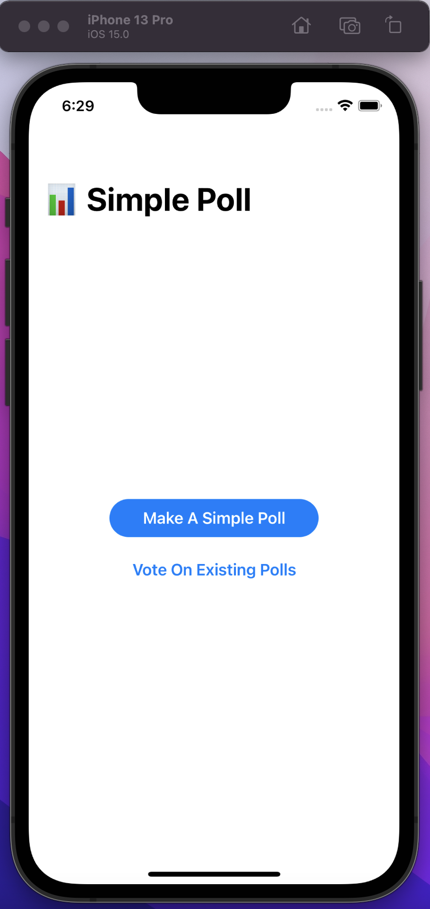
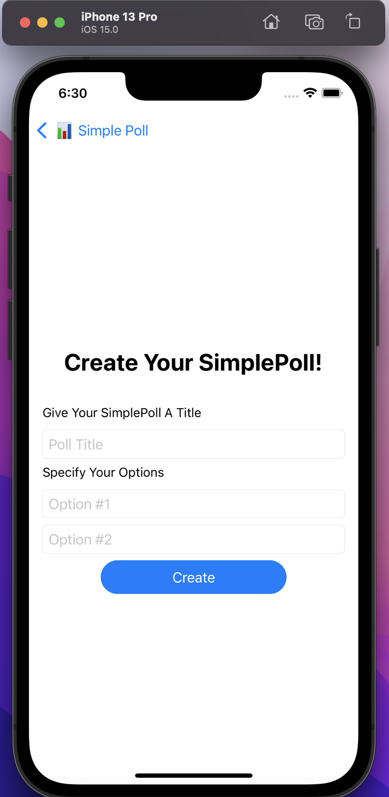
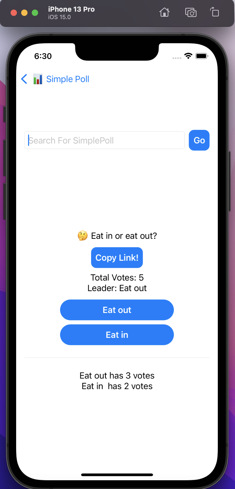

# SimplePoll App

This is the long awaited iOS App for SimplePoll! Introducing cross platform functionality! Vote on polls that your friends make on the website! Create polls on the app and vote on them from the web!
Note: This project was completed in November 2021.

## Product Images

### Landing Page

### Create Poll

### Vote on Poll

### How To Run Locally

1. Clone or download this repo
2. Open the project in XCode
3. Build the project
4. Select the simultor or device you want to run on
5. Viola!

## Tech Talk

I built this app using SwiftUI, leveraging the MVVM architecture.
I built a network manager class that defines general functions to create, vote, and search for polls.
I use SwiftUI Navigtion to control the user flow of the app, and incorporate multithreading in the MakePollViewModel, and PollVoteViewModel to update the view.
